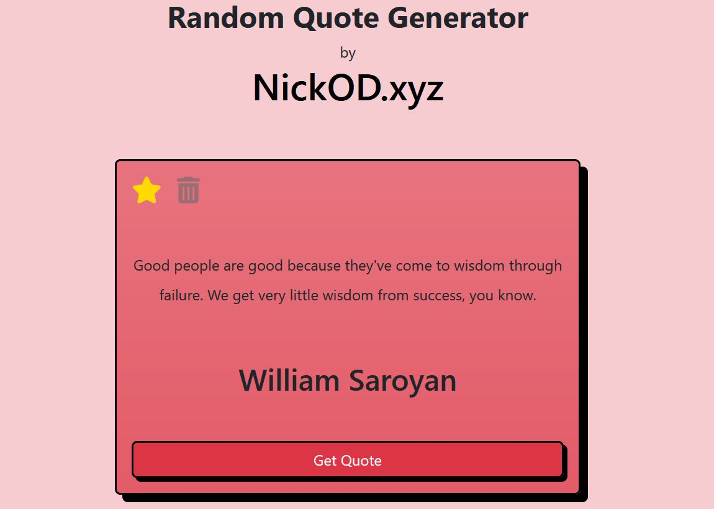

<h1 align="center">Random Qoute Generator | NickOD.xyz</h1>

 

## Overview

This is a random quote generator using and API and styled with Bootstrap

-   [API Github](https://github.com/lukePeavey/quotable)
-   [EndPoint](https://api.quotable.io/random)

 

## Site To-Do

-   Set HTML
-   Style with bootstrap
-   Write js to interact with API

 

## What I learned

Working with APIs, I used an eventListener on DOMContentLoaded. With this I wrote an async function "getQuote" that called on page load, enabling a quote to appear on the page everytime it is view. Within this function I used a try catch for the fetch API method.

Styling with bootstrap. Whilst I'm not 100% sold on using css framworks, I'm happy this site doesn't immediately scream BOOTSTRAP when viewed.

 

## Built with

-   Mobile First Workflow
-   Semantic HTML5 Markup
-   Bootstrap
-   JS

 

## Site links

[Random Quote Generator](https://nick-odonoghue.github.io/random-quote-generator/)

[NickOD.xyz](https://www.NickOD.xyz)

 

## Useful resources

[w3schools](https://www.w3schools.com/)

[Bootstrap](https://getbootstrap.com/)

 

## Author

-   Website - [NickOD.xyz](http://www.NickOD.xyz)
-   LinkedIn - [LinkedIn](https://www.linkedin.com/in/nick-odonoghue/)

 

## Acknowledgments

[Le Wagon](https://www.lewagon.com/) & all the teachers, TAs and classmates from <em>1122</em>

[Frontend Mentor](https://www.frontendmentor.io/) & everyone kind enough to leave feedback

[w3schools](https://www.w3schools.com/)

[Web Dev Simplified](https://www.youtube.com/WebDevSimplified)

[Kevin Powell](https://www.youtube.com/kepowob)

[Wes Bos](https://wesbos.com/)
